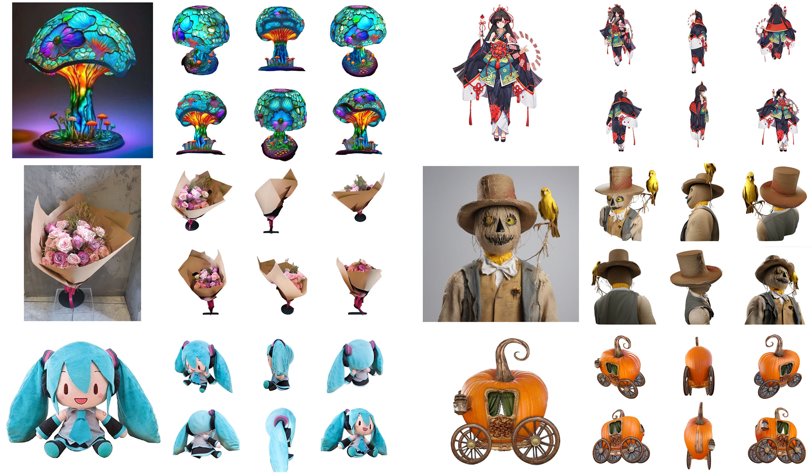
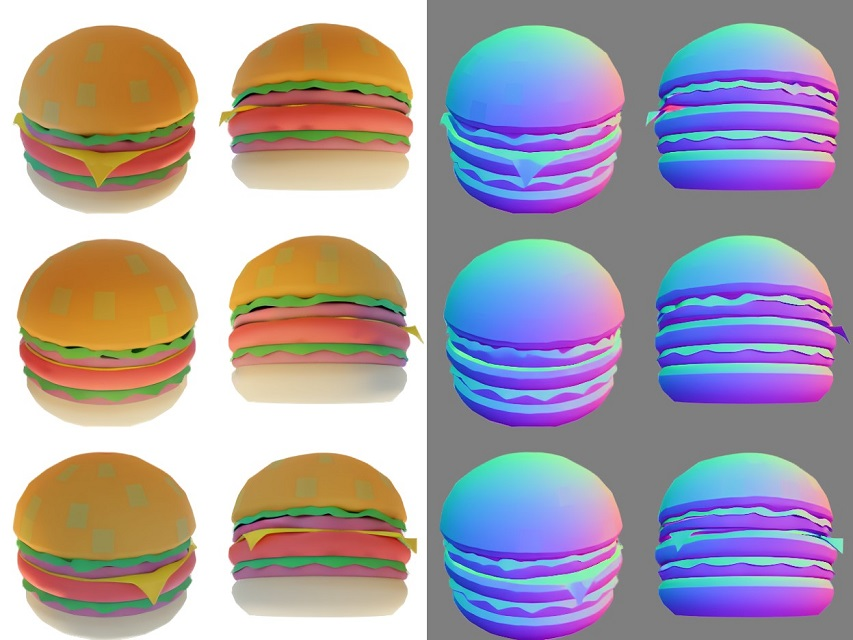

# Zero123++: A Single Image to Consistent Multi-view Diffusion Base Model



[\[Report\]](https://arxiv.org/abs/2310.15110) 
[\[Official Demo\]](https://huggingface.co/spaces/sudo-ai/zero123plus-demo-space) 
[\[Demo by @yvrjsharma\]](https://huggingface.co/spaces/ysharma/Zero123PlusDemo) 
[\[Google Colab\]](https://colab.research.google.com/drive/1_5ECnTOosRuAsm2tUp0zvBG0DppL-F3V?usp=sharing)
[\[Replicate demo\]](https://replicate.com/jd7h/zero123plusplus)

## UPDATES v1.2

We are thrilled to release Zero123++ v1.2! Main changes:

+ Camera intrinsics are handled more delibrately. The v1.2 model is more robust to a wider range of input field of views, croppings and unifies the output field of view to **30°** to better reflect that of realistic close-up views.
+ The fixed set of elevations are changed from 30° and -20° to **20°** and **-10°**.
+ In contrast with novel-view synthesis, the model focuses more for 3D generation. The model always outputs a set of views assuming a normalized object size instead of changing w.r.t. the input.

Additionally, we have a **normal generator** ControlNet that can generate view-space normal images. The output can also be used to obtain a more accurate mask than the SAM-based approach. Validation metrics on our validation set from Objaverse: alpha (before matting) IoU 98.81%, mean normal angular error 10.75°, normal PSNR 26.93 dB.



### Usage

Use of the v1.2 base model is unchanged. Please see the sections below for usage.

**Use of the normal generator:** See [examples/normal_gen.py](examples/normal_gen.py).

For **alpha mask generation** from the normal images, please see [examples/matting_postprocess.py](examples/matting_postprocess.py) and [examples/normal_gen.py](examples/normal_gen.py).

### License

The code is released under Apache 2.0 and the model weights are released under CC-BY-NC 4.0.

This means that you cannot use the model (or its derivatives) in a commercial product pipeline, but you can still use the outputs from the model freely. And, you are accountable for the output you generate and its subsequent uses.

## Get Started

You will need `torch` (recommended `2.0` or higher), `diffusers` (recommended `0.20.2`), and `transformers` to start. If you are using `torch` `1.x`, it is recommended to install `xformers` to compute attention in the model efficiently. The code also runs on older versions of `diffusers`, but you may see a decrease in model performance.

And you are all set! We provide a custom pipeline for `diffusers`, so no extra code is required.

To generate multi-view images from a single input image, you can run the following code (also see [examples/img_to_mv.py](examples/img_to_mv.py)):

```python
import torch
import requests
from PIL import Image
from diffusers import DiffusionPipeline, EulerAncestralDiscreteScheduler

# Load the pipeline
pipeline = DiffusionPipeline.from_pretrained(
    "sudo-ai/zero123plus-v1.1", custom_pipeline="sudo-ai/zero123plus-pipeline",
    torch_dtype=torch.float16
)

# Feel free to tune the scheduler!
# `timestep_spacing` parameter is not supported in older versions of `diffusers`
# so there may be performance degradations
# We recommend using `diffusers==0.20.2`
pipeline.scheduler = EulerAncestralDiscreteScheduler.from_config(
    pipeline.scheduler.config, timestep_spacing='trailing'
)
pipeline.to('cuda:0')

# Download an example image.
cond = Image.open(requests.get("https://d.skis.ltd/nrp/sample-data/lysol.png", stream=True).raw)

# Run the pipeline!
result = pipeline(cond, num_inference_steps=75).images[0]
# for general real and synthetic images of general objects
# usually it is enough to have around 28 inference steps
# for images with delicate details like faces (real or anime)
# you may need 75-100 steps for the details to construct

result.show()
result.save("output.png")
```

The above example requires ~5GB VRAM to run.
The input image needs to be square, and the recommended image resolution is `>=320x320`.

By default, Zero123++ generates opaque images with a gray background (the `zero` for Stable Diffusion VAE).
You may run an extra background removal pass like `rembg` to remove the gray background.

```python
# !pip install rembg
import rembg
result = rembg.remove(result)
result.show()
```

To run the depth ControlNet, you can use the following example (also see [examples/depth_controlnet.py](examples/depth_controlnet.py)):

```python
import torch
import requests
from PIL import Image
from diffusers import DiffusionPipeline, EulerAncestralDiscreteScheduler, ControlNetModel

# Load the pipeline
pipeline = DiffusionPipeline.from_pretrained(
    "sudo-ai/zero123plus-v1.1", custom_pipeline="sudo-ai/zero123plus-pipeline",
    torch_dtype=torch.float16
)
pipeline.add_controlnet(ControlNetModel.from_pretrained(
    "sudo-ai/controlnet-zp11-depth-v1", torch_dtype=torch.float16
), conditioning_scale=0.75)
# Feel free to tune the scheduler
pipeline.scheduler = EulerAncestralDiscreteScheduler.from_config(
    pipeline.scheduler.config, timestep_spacing='trailing'
)
pipeline.to('cuda:0')
# Run the pipeline
cond = Image.open(requests.get("https://d.skis.ltd/nrp/sample-data/0_cond.png", stream=True).raw)
depth = Image.open(requests.get("https://d.skis.ltd/nrp/sample-data/0_depth.png", stream=True).raw)
result = pipeline(cond, depth_image=depth, num_inference_steps=36).images[0]
result.show()
result.save("output.png")
```

This example requires ~5.7GB VRAM to run.

## Models

The models are available at [https://huggingface.co/sudo-ai](https://huggingface.co/sudo-ai):

+ `sudo-ai/zero123plus-v1.1`, base Zero123++ model release (v1.1).
+ `sudo-ai/controlnet-zp11-depth-v1`, depth ControlNet checkpoint release (v1) for Zero123++ (v1.1).
+ `sudo-ai/zero123plus-v1.2`, base Zero123++ model release (v1.2).
+ `sudo-ai/controlnet-zp12-normal-gen-v1`, normal generation ControlNet checkpoint release (v1) for Zero123++ (v1.2).

The source code for the diffusers custom pipeline is available in the [diffusers-support](diffusers-support) directory.

## Camera Parameters

Output views are a fixed set of camera poses:

+ Azimuth (relative to input view): `30, 90, 150, 210, 270, 330`.
+ v1.1 Elevation (absolute): `30, -20, 30, -20, 30, -20`.
+ v1.2 Elevation (absolute): `20, -10, 20, -10, 20, -10`.
+ v1.2 Field of View (absolute): `30°`.

## Running Demo Locally

You will need to install extra dependencies:
```
pip install -r requirements.txt
```

Then run `streamlit run app.py`.

For Gradio Demo, you can run `python gradio_app.py`.

## Related Work
[\[One-2-3-45\]](https://github.com/One-2-3-45/One-2-3-45) [\[One-2-3-45++\]](https://sudo-ai-3d.github.io/One2345plus_page/) [\[Zero123\]](https://github.com/cvlab-columbia/zero123)

## Citation

If you found Zero123++ helpful, please cite our report:
```bibtex
@misc{shi2023zero123plus,
      title={Zero123++: a Single Image to Consistent Multi-view Diffusion Base Model}, 
      author={Ruoxi Shi and Hansheng Chen and Zhuoyang Zhang and Minghua Liu and Chao Xu and Xinyue Wei and Linghao Chen and Chong Zeng and Hao Su},
      year={2023},
      eprint={2310.15110},
      archivePrefix={arXiv},
      primaryClass={cs.CV}
}
```
